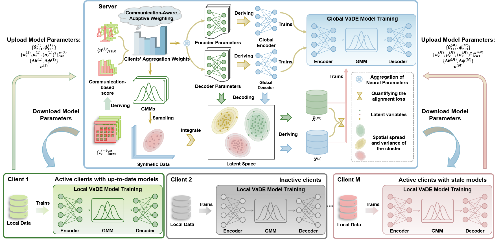

# Asynchronous Federated Variational Deep Embedding for Privacy-Preserving Clustering over Heterogeneous Edge Devices
## Intro
This repo contains the code and experiment results of our proposed AFVaDE.

## Requirements
- pytorch==2.0.1
- numpy==1.25.2
- pandas==2.3.2
- scikit-learn==1.7.2
- scipy==1.15.3
- munkres==1.1.4
## How to run
```shell
python main.py --dataset xxx
```
**xxx: select the dataset you want to run.** 
## Example
```shell
python main.py --dataset iris
```
## Comparison Results
Index,Data,kFed,NN-FC,FFCM-1,FFCM-2,Fed-SSC,Fed-TSC,FedSC,AFCL,SFK,FKDC,GOLD,AFVaDE (Ours)
Purity,IR,0.8213,0.7033,0.4880,0.4400,0.5467,0.6200,0.5200,0.7956,0.8267,0.6900,0.7627,0.8847
Purity,PA,0.7538,0.7538,0.7538,0.7538,0.7538,0.7538,0.7538,0.7538,0.7538,0.7662,0.7538,0.7877
Purity,GL,0.5098,0.4780,0.4079,0.4093,0.4682,0.5565,0.3659,0.5047,0.5330,0.4836,0.5285,0.5402
Purity,BC,0.6754,0.6880,0.6274,0.6274,0.6620,0.6274,0.8211,0.6274,0.8378,0.8656,0.8789,0.9014
Purity,AU,0.6082,0.6218,0.6070,0.6070,0.6263,0.7268,0.6070,0.6966,0.6082,0.6945,0.6964,0.9416
Purity,BA,0.6616,0.6122,0.5603,0.5619,0.5554,0.5554,0.5695,0.5554,0.5882,0.6030,0.6001,0.6753
Purity,YE,0.4815,0.3378,0.4026,0.3956,0.4764,0.4787,0.3152,0.3120,0.4528,0.4713,0.4332,0.5228
Purity,WQ,0.4640,0.4531,0.4560,0.4510,0.4646,0.4539,0.4369,0.4365,0.4546,0.4651,0.4565,0.4679
Purity,DE,0.6698,0.6699,0.6698,0.6698,0.6698,0.6698,-,0.6698,0.6698,0.6698,0.6698,0.6721
Purity,OC,0.4773,0.4727,0.4728,0.4728,-,0.4724,-,-,0.4784,0.4785,-,0.4786
Purity,RA,0.4530,0.4050,0.2712,0.2554,0.4356,0.4358,-,0.1784,0.4568,0.4236,0.3551,0.4699
Purity,RS,0.3707,0.3312,0.2709,0.2623,0.3694,0.3502,-,0.2486,0.3903,0.3402,0.3382,0.3910
Purity,PT,0.3567,0.2459,0.2093,0.1910,-,0.3097,-,-,0.3487,0.3392,0.3129,0.3716
Purity,TI,0.3770,0.3208,0.3259,0.3261,-,0.3735,-,-,0.3745,0.3666,-,0.4034
-,Avg. Rank,3.64,6.50,7.71,8.14,5.82,5.29,8.63,7.64,3.93,4.36,4.83,1.07
,,,,,,,,,,,,,
ARI,IR,0.6071,0.4093,0.0925,0.0446,0.1854,0.1952,0.2500,0.5889,0.6088,0.4726,0.5120,0.7108
ARI,PA,-0.0644,0.0283,-0.0068,-0.0047,0.0595,-0.0020,-0.0069,0.0103,-0.0766,0.0870,0.1310,0.2910
ARI,GL,0.1765,0.1094,0.0405,0.0368,0.0891,0.1871,0.0054,0.1570,0.2079,0.0881,0.1987,0.2323
ARI,BC,0.0758,0.1203,0.0002,0.0043,0.0887,0.0007,0.4558,0.0000,0.4465,0.5755,0.5969,0.6426
ARI,AU,0.0014,0.0171,0.0036,0.0053,0.0224,0.1946,-0.0009,0.1920,0.0014,0.1236,0.1282,0.7796
ARI,BA,0.1091,0.0571,0.0118,0.0125,0.0030,-0.0006,0.0186,0.0000,0.0327,0.0485,0.0457,0.1176
ARI,YE,0.1668,0.0254,0.1057,0.0898,0.0876,0.0940,-0.0011,0.0000,0.1495,0.1861,0.0805,0.1720
ARI,WQ,0.0086,0.0092,0.0101,0.0130,0.0081,0.0230,0.0002,0.0000,0.0201,0.0312,0.0276,0.0340
ARI,DE,0.0582,0.0410,0.0201,0.0101,0.0138,0.0218,-,0.0000,0.0536,0.0498,0.0032,0.1760
ARI,OC,0.0162,0.0020,0.0037,0.0046,-,0.0046,-,-,0.0092,0.0080,-,0.0218
ARI,RA,0.2315,0.1203,0.0886,0.0751,0.2037,0.1814,-,0.0000,0.1940,0.1198,0.1254,0.2417
ARI,RS,0.1361,0.1056,0.0525,0.0298,0.1054,0.0854,-,0.0000,0.1365,0.0964,0.0995,0.1707
ARI,PT,0.1518,0.0664,0.0213,0.0137,-,0.1043,-,-,0.1385,0.1293,0.0952,0.1706
ARI,TI,0.0527,0.0203,0.0090,0.0091,-,0.0292,-,-,0.0461,0.0475,-,0.0543
-,Avg. Rank,4.57,6.43,8.50,8.50,7.18,6.29,9.50,8.91,4.64,4.50,5.08,1.07
,,,,,,,,,,,,,
NMI,IR,0.6605,0.4961,0.1412,0.0908,0.2107,0.2653,0.3423,0.6436,0.6525,0.6004,0.5745,0.7319
NMI,PA,0.0465,0.1078,0.0031,0.0030,0.0690,0.0045,0.0049,0.1504,0.0583,0.1392,0.2096,0.1628
NMI,GL,0.3146,0.2305,0.0906,0.0982,0.1898,0.3333,0.0525,0.2954,0.3448,0.1918,0.3439,0.3663
NMI,BC,0.1074,0.1324,0.0037,0.0063,0.0442,0.0007,0.3778,0.0000,0.3913,0.4957,0.5181,0.5184
NMI,AU,0.0035,0.0370,0.0084,0.0106,0.0479,0.1391,0.0019,0.1873,0.0035,0.1827,0.1859,0.6774
NMI,BA,0.0894,0.0439,0.0052,0.0056,0.0028,0.0002,0.0164,0.0000,0.0221,0.0560,0.0768,0.1359
NMI,YE,0.2564,0.0985,0.1670,0.1579,0.1963,0.2084,0.0104,0.0000,0.2459,0.2638,0.1962,0.2809
NMI,WQ,0.0387,0.0302,0.0198,0.0204,0.0340,0.0533,0.0031,0.0000,0.0441,0.0534,0.0467,0.0543
NMI,DE,0.0829,0.0528,0.0167,0.0144,0.0358,0.0304,-,0.0000,0.0834,0.0862,0.0655,0.0910
NMI,OC,0.0067,0.0008,0.0014,0.0015,-,0.0014,-,-,0.0037,0.0038,-,0.0072
NMI,RA,0.4176,0.3710,0.1512,0.1332,0.3616,0.3678,-,0.0000,0.4054,0.4010,0.2908,0.3679
NMI,RS,0.2874,0.2312,0.1210,0.0966,0.2433,0.2104,-,0.0000,0.2938,0.2522,0.2591,0.2725
NMI,PT,0.2773,0.1714,0.0759,0.0561,-,0.1648,-,-,0.2820,0.2850,0.2670,0.2992
NMI,TI,0.0589,0.0308,0.0168,0.0152,-,0.0330,-,-,0.0498,0.0565,-,0.0642
-,Avg. Rank,4.14,6.57,9.07,9.21,7.45,7.00,9.38,8.73,4.14,3.57,4.25,1.50
,,,,,,,,,,,,,
ACC,IR,0.8213,0.6987,0.4780,0.4227,0.5267,0.6200,0.5040,0.7956,0.8267,0.6393,0.7560,0.8847
ACC,PA,0.6908,0.6585,0.6036,0.6041,0.6256,0.5231,0.7487,0.6421,0.6708,0.6641,0.6826,0.7877
ACC,GL,0.4626,0.4033,0.3626,0.3687,0.3621,0.4332,0.3533,0.4533,0.5009,0.4033,0.4626,0.5042
ACC,BC,0.6754,0.6873,0.5675,0.5589,0.6620,0.5272,0.8211,0.6274,0.8378,0.8638,0.8789,0.9014
ACC,AU,0.6082,0.6218,0.5299,0.5535,0.6263,0.7268,0.6057,0.6966,0.6082,0.6945,0.6964,0.9416
ACC,BA,0.6616,0.5934,0.5603,0.5619,0.5308,0.5046,0.5695,0.5554,0.5882,0.6013,0.5995,0.6753
ACC,YE,0.4278,0.3292,0.3834,0.3736,0.3540,0.3539,0.3108,0.3120,0.4068,0.4447,0.3468,0.4625
ACC,WQ,0.3873,0.3988,0.3060,0.3082,0.2761,0.2511,0.4363,0.4365,0.3642,0.3626,0.3214,0.3551
ACC,DE,0.3540,0.4495,0.3874,0.3636,0.2348,0.2302,-,0.6698,0.3428,0.3434,0.2986,0.4921
ACC,OC,0.4453,0.4718,0.4600,0.4605,-,0.3453,-,-,0.4717,0.4757,-,0.4023
ACC,RA,0.4093,0.3165,0.2591,0.2448,0.3665,0.3646,-,0.1784,0.3449,0.3128,0.3294,0.4434
ACC,RS,0.3106,0.3032,0.2318,0.2214,0.2797,0.2265,-,0.2486,0.3023,0.2986,0.2826,0.3376
ACC,PT,0.3492,0.2345,0.1989,0.1857,-,0.2612,-,-,0.3379,0.3346,0.2966,0.3636
ACC,TI,0.2726,0.2893,0.2817,0.2818,-,0.2394,-,-,0.2629,0.3070,-,0.3364
-,Avg. Rank,4.07,5.43,8.43,8.50,8.36,8.50,7.50,6.45,4.71,4.71,5.42,1.93
